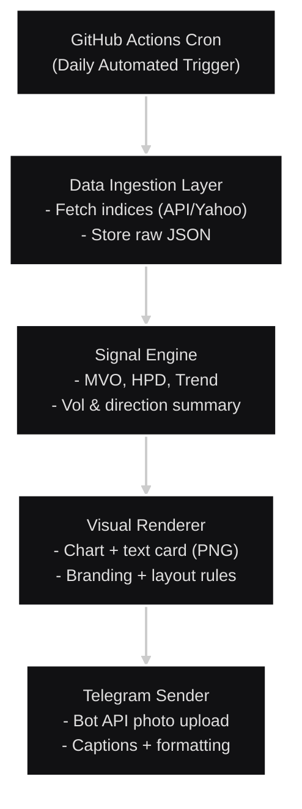

## Automated Data Delivery System (Hestrate)
Author: Jnandeep Dev Sarma

Contact: jnandeepdevsarma@gmail.com

# Project Summary

A fully automated, serverless market-intelligence delivery system that fetches global index data, computes signals (MVO, HPD, Trend), generates visual report cards, and delivers them directly to Telegram every morning without any manual intervention.

The system runs entirely on GitHub Actions using scheduled cron workflows — eliminating the need for servers, VPS, or human involvement. It is modular, production-ready, and engineered for reliability, clarity, and speed.

This project demonstrates architectural quality, automation expertise, and professional handling of data pipelines and reporting workflows.

#Core Highlights

1. Fully Automated Data Pipeline (Serverless)
Runs daily through GitHub Actions (cron + workflow_dispatch).
No server, no hosting, no maintenance.
Fetches global indices, forex, commodities, or custom market feeds.
Auto-creates daily PNG “market overview cards”.

2. Intelligent Signal Engine
Computes market sentiment  custom signals
Outputs a structured signal file clean enough to plug into any trading workflow.

3. Automated Telegram Delivery
Uses Telegram Bot API to deliver reports instantly.
Clean formatted caption + PNG summary.
Supports personal chats, private channels, or groups.

4. Modular Architecture
Each component is isolated for easy debugging and scaling:

5. Multi-Index & Multi-Language Support
Supports multiple global indices..
Formatting automatically adjusts based on asset type.

# Repository Structure

```bash
data-delivery-automation/
│
├─ README.md
├─ requirements.txt
│
├─ .github/
│   └─ workflows/
│       └─ daily_report.yml
│
├─ scripts/
│   ├─ fetch_data.py
│   ├─ signal_engine.py
│   ├─ render_card.py
│   └─ send_telegram.py
│
├─ output_samples/
│   ├─ sample_report.png
│   └─ sample_signals.json
│
└─ docs/
    ├─ architecture_diagram.png
    ├─ pipeline_flow.png
    ├─ formatting_template.png
    └─ telegram_delivery_flow.txt
```

# Architecture Diagram (Text-Based)

## Architecture



# Documentation Included

Inside /docs:
- architecture_diagram.png
	-Shows the complete serverless architecture & automation pipeline.

- pipeline_flow.png
	- Illustrates the step-by-step data pipeline.

- formatting_template.png
	- Template used for PNG market report cards.

- telegram_delivery_flow.txt
	- Clear explanation of how bot delivery & authentication works.

#Sample Output Provided

Inside /output_samples:

- sample_report.png
	- A fully rendered market summary card.

- sample_signals.json
	- Shows the exact signal output structure for reference.

# Core Scripts Explained

Pulls global index prices (Yahoo/API).
fetch_data.py

Saves to raw JSON.
signal_engine.py

Computes Signals
Normalizes and structures signals.

Generates a PNG card using matplotlib + PIL.
render_card.py

Clean, minimal visual design.
send_telegram.py

Sends the PNG & caption to Telegram automatically.

# Requirements

requests
pandas
numpy
matplotlib
Pillow
python-telegram-bot
pyyaml

# Setup Instructions

1. Clone the repository
```bash 
git clone https://github.com/YOUR_USERNAME/automated-data-delivery
cd automated-data-delivery
```

2. Add GitHub Secrets
Go to:
```bash
Repo → Settings → Secrets → Actions
```
Add:
```bash
Secret Name		Value
TELEGRAM_BOT_TOKEN	Your bot token (from BotFather)
TELEGRAM_CHAT_ID		Your chat/group/channel ID
(Optional) API_KEY		If using external market API
```

# GitHub Actions Automation

The workflow file (daily_report.yml) controls automation.
Default cron:
``` bash
0 22 * * 0-4   # 22:00 UTC, Monday–Friday
```

If you want 06:30 AM IST:
``` bash
0 1 * * 1-5    # 01:00 UTC = 06:30 IST
```
# Running Locally (Optional)

Install dependencies
```bash
python -m venv .venv
source .venv/bin/activate       # Linux/macOS
.venv\Scripts\activate          # Windows
pip install -r requirements.txt
```

# Set environment variables
``` bash
export TELEGRAM_BOT_TOKEN=xxxx
export TELEGRAM_CHAT_ID=yyyy
```

# Run pipeline

```bash
python scripts/fetch_data.py --out data.json
python scripts/signal_engine.py --in data.json --out signals.json
python  scripts/render_card.py --in signals.json --out report.png --template assets/bg_ndq.png
python scripts/send_telegram.py --image report.png --text "Daily Market Overview"
```

Report will appear in Telegram.

